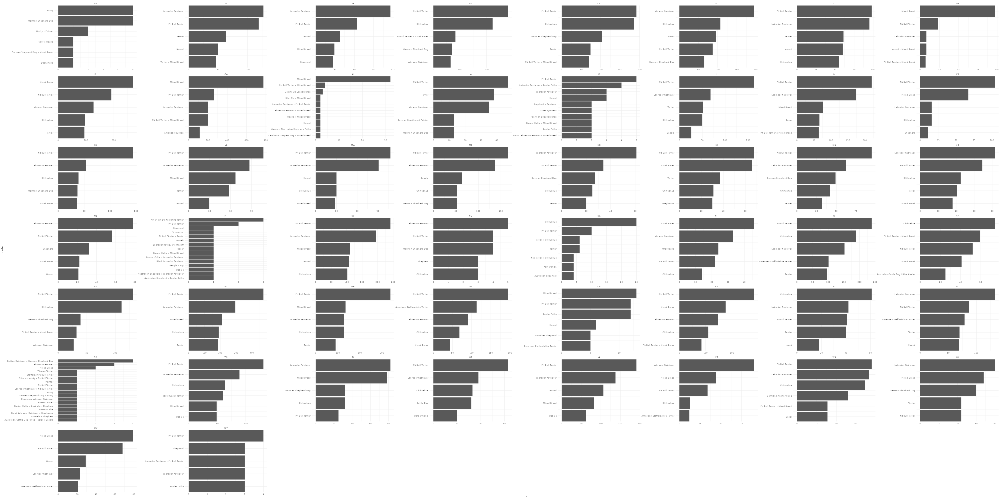

<!-- README.md is generated from README.Rmd. Please edit that file -->

```{r, include = FALSE}
knitr::opts_chunk$set(
  collapse = TRUE,
  comment = "#>"
)
```

# adoptable-dogs

<!-- badges: start -->
<!-- badges: end -->

## Moves


## Most popular names


## Most popular breeds


